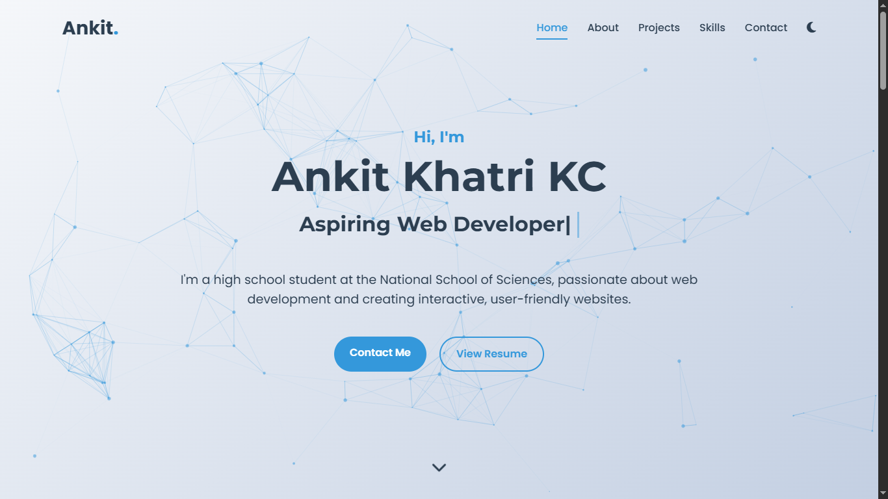

# Ankit Khatri KC - Portfolio

Welcome to my personal portfolio website! This project showcases my skills, projects, education, and hobbies as a high school student studying Computer Science at the National School of Sciences. I'm passionate about web development and enjoy building interactive and user-friendly websites.

## Features

- **Responsive Design**: Works seamlessly on all devices (desktop, tablet, mobile).
- **Dark/Light Mode**: Toggle between light and dark themes for better user experience.
- **Sections**:
  - **About Me**: A brief introduction about myself.
  - **Education**: Details about my academic background.
  - **Projects**: Showcase of my web development projects.
  - **Skills**: List of my technical skills.
  - **Hobbies**: A glimpse into my interests outside of coding.
  - **Contact**: Easy way to get in touch with me.
- **Interactive Elements**: Buttons, links, and animations to enhance user engagement.

## Technologies Used

- **HTML5**: For structuring the content.
- **CSS3**: For styling and layout.
- **JavaScript**: For interactivity (theme toggling, navigation menu).
- **Font Awesome**: For icons.
- **Google Fonts**: For typography (Poppins font).
